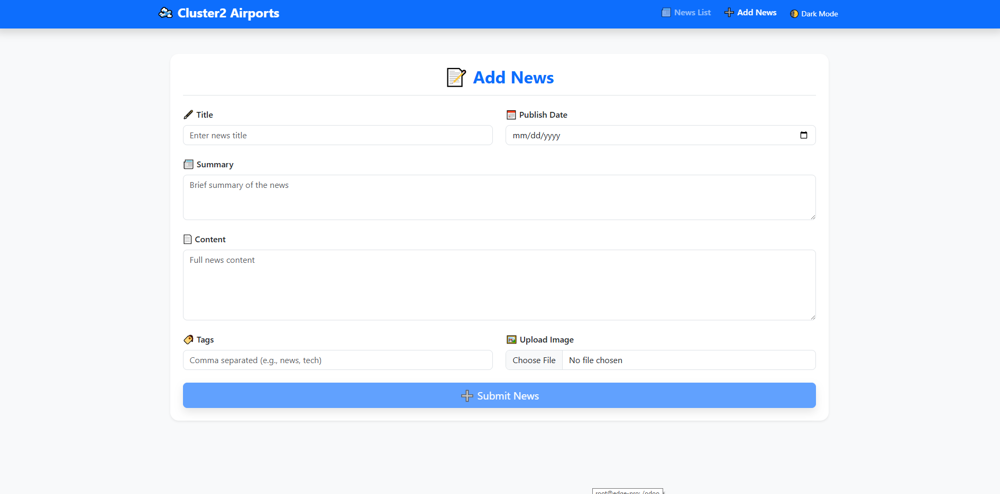
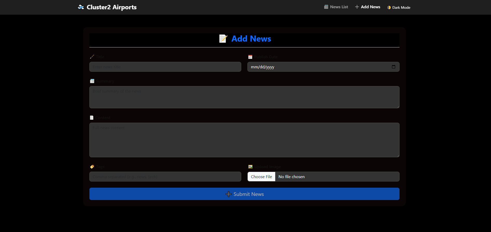
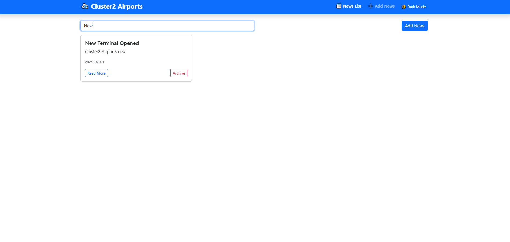

# 🛫 Cluster2 Airports News Portal

A responsive Angular 18 application for managing and displaying company news for **Cluster2 Airports**. Users can browse, add, archive, and search news articles in a smooth modern UI with dark mode and animations.

---

## 📦 Project Info

This project was generated using [Angular CLI](https://github.com/angular/angular-cli) version **18.2.20**.

---

## ✨ Features

- 📰 **News Dashboard** – List of all news articles with title, summary & publish date
- ➕ **Add News** – Add new articles with form fields (title, content, tags, image, date)
- 🔍 **Search** – Filter news in real time by title or content
- 🗂️ **Archive** – Archive unwanted news with a click
- 🌙 **Dark Mode** – Toggle light/dark themes
- 📱 **Responsive** – Works perfectly on mobile, tablet, and desktop
- 🎨 **Animations** – Smooth transitions, form validation feedback, fade-ins
- 💾 **In-Memory Data** – No backend, uses mock data only

---

## 🧰 Tech Stack

| Tool        | Description           |
| ----------- | --------------------- |
| Angular 18  | Front-end framework   |
| Bootstrap 5 | Styling and layout    |
| TypeScript  | Language              |
| Animate.css | Predefined animations |
| RxJS        | Reactive programming  |

---

## 📸 Screenshots

### 🏠 News Dashboard


### ➕ Add News Form



### 🌙 Dark Mode Enabled



### 🔍 Filter News



---

## 🚀 Getting Started

1. **Clone the project**

   ```bash
   git clone https://github.com/MhmdTahaSheRif/Cluster2-Airports.git
   cd Cluster2-Airports
   ```
